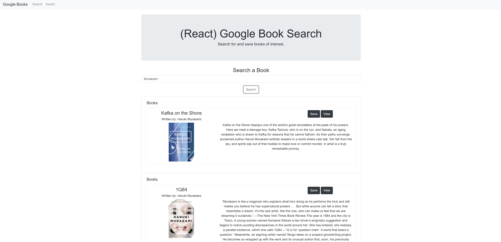

# React Google Book Search
Google Book Search application where users can search, view, and save books they are interested in.

## Description
This is a React based application which utilizes the Google Books API and MongoDB in order to search for and save books to the server database. To use the application, simply enter a book title and then the application will bring up search results for relevant books and the information of the books. Clicking the view button will open a new tab linking to the Google Books page for the book and then the save button will save the book information to the database which can be accessed via the "Saved" page.

## Table of Contents
* [Getting Started](#getting-started)
* [Installation](#installation)
* [Usage](#usage)
* [Technologies](#technologies)
* [Author](#author)
* [Acknowledgments](#acknowledgments)
* [License](#license)

## Getting Started
* [Github Repository](https://github.com/nathanmvu/react-book-search)
* [Deployed Link](https://nathanmvu.github.io/react-book-search/)
* [Usage Demo Video](https://drive.google.com/file/d/1JAu-LMIW0I-uX_CaP7ygxB4uHDlosKgV/view)


## Installation
* [Deployed Link](https://nathanmvu.github.io/react-book-search/)
To run the program, install it from the repository and then navigate to the server.js file in the src folder. In an integrated terminal run
`npm start`
and the program will launch in a web browser.

## Usage
Search Results:


Saved Books:


### Code Snippet
The code below shows how search inputs are handled and rendered onto the Search page. It includes a workaround to handling the issue of API response data having an undefined imageLink attribute. In it's current state, the application will always try to render 10 entries for results onto the page and so no attributes for book results can be left undefined.
```
<div className="container">
    <h3>Search a Book</h3>
    <input type="text" value={this.state.value} onChange={this.handleChange} className="form-control" placeholder="Search..." aria-label="Recipient's username" aria-describedby="button-addon2"></input>
    <button className="btn btn-outline-secondary mt-3 mb-3" onClick={this.handleSubmit} type="button" id="button-addon2">Search</button>
    {this.state.books.map(book => 
        <Items 
            title={book.volumeInfo.title} 
            author={book.volumeInfo.authors} 
            description={book.volumeInfo.description} 
            link={book.volumeInfo.infoLink} 
            image={
                book.volumeInfo.imageLinks === undefined
                    ? ""
                    : `${book.volumeInfo.imageLinks.thumbnail}`
            }
        />  
        )}           
</div>
```

## Technologies

* [React](https://www.react.com/)
* [MongoDB](https://www.mongodb.com/)
* [Node.js](https://nodejs.org/en/)
* [NPM](https://www.npmjs.com/)
* [Axios](https://www.npmjs.com/package/axios/)

## Authors
**Gabriel Pineda** 
- [Github](https://github.com/GabrielPineda808)
- [LinkedIn](https://www.linkedin.com/in/gabriel-pineda-a94535195/)

**Nathan Vu**
- [Github](https://github.com/nathanmvu)
- [Email](mailto:nathanvu99@gmail.com)

## Acknowledgments
* Project parameters provided by the UCB Extension Coding Bootcamp

## License
[](https://github.com/tterb/atomic-design-ui/blob/master/LICENSEs)